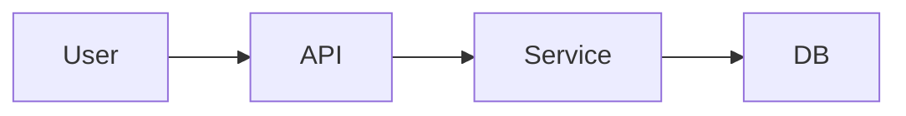

# Optional Phase: Architecture

You are running the **Architecture** skill.

User request / target:

`$ARGUMENTS`

## Purpose

Analyze or design architecture without immediately coding.

This skill can be used in two modes:

1. **New idea / after research**  
   Create a proposed architecture based on `docs/00-research.md`.

2. **Existing service / existing codebase**  
   Reverse-engineer, document, review, and improve the current architecture.

## Hard rules

- Do **not** write implementation code by default.
- Do **not** create infrastructure files, migrations, or application code unless the user explicitly asks after the analysis.
- Do **not** invent architecture that is not supported by the repository or research.
- Prefer concrete trade-offs over vague “best practices”.
- Main output must be `docs/02-architecture.md`.

## Working process

1. Determine whether this is:
   - New architecture design, or
   - Existing architecture review.
2. Read relevant docs:
   - `docs/00-research.md`, if present.
   - `docs/01-plan.md`, if present.
   - Existing README/docs.
3. Inspect source code and infrastructure if this is an existing service.
4. Identify modules, boundaries, dependencies, external systems, data flows, and runtime/deployment model.
5. Identify architectural risks and improvement options.
6. Recommend an architecture or architecture changes.

## Output file

Create or update:

`docs/02-architecture.md`

Use this structure:

````md
# Architecture

## 1. Purpose

What this architecture document is for.

## 2. Context

Business/product/technical context.

## 3. Current Architecture

For existing systems:
- Modules/components
- External dependencies
- Runtime/deployment model
- Communication patterns
- Data stores
- Observability/logging/monitoring

For new systems:
- Proposed context
- Expected major components
- Main assumptions

## 4. Architecture Diagram

Use Mermaid if useful.

Example:



## 5. Component Responsibilities

Table:

| Component | Responsibility | Notes |
|---|---|---|

## 6. Key Flows

Describe important request/event/data flows.

## 7. Integration Points

External APIs, queues, databases, identity providers, cloud services, etc.

## 8. Data Flow

High-level data movement. Detailed persistence belongs in `data-model` if needed.

## 9. Non-Functional Considerations

Security, reliability, observability, scalability, performance, cost, maintainability.

## 10. Architecture Decisions

Use ADR-style entries:

### ADR-001: Decision title

- Status: proposed / accepted / rejected
- Context
- Decision
- Consequences
- Alternatives considered

## 11. Risks / Problems

Architectural risks and design smells.

## 12. Recommendations

Prioritized recommendations.

## 13. Impact on Plan

What should be changed in `docs/01-plan.md`, if anything.
````

## Completion criteria

Architecture work is complete only when:

- The architecture is understandable without reading the whole codebase.
- Major components and flows are documented.
- Trade-offs and risks are explicit.
- Recommendations are prioritized.
- The impact on the plan is clear.

At the end, summarize:

1. Whether this is current-state documentation, proposed architecture, or architecture review.
2. The biggest architectural risk.
3. The recommended next step.
