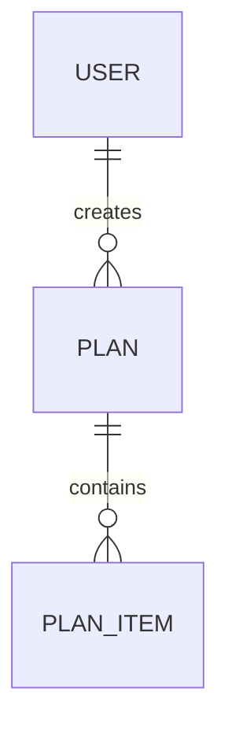

# Optional Phase: Data Model

You are running the **Data Model** skill.

User request / target:

`$ARGUMENTS`

## Purpose

Analyze, document, review, or redesign the data/domain model before implementation.

This skill can be used for:

- New product/domain modeling.
- Existing database/schema review.
- Entity/domain model cleanup.
- Migration planning.
- Indexing and query analysis.
- Event/data flow design.
- Data consistency and integrity review.

## Hard rules

- Do **not** create migrations by default.
- Do **not** change entity classes, repositories, SQL, Terraform, or production code by default.
- Do **not** assume the database engine if it is not visible.
- Separate conceptual/domain model from physical persistence model.
- Main output must be `docs/03-data-model.md`.

## Working process

1. Determine whether this is:
   - New data model design,
   - Existing data model documentation,
   - Data model review,
   - Migration/redesign proposal.
2. Read relevant docs:
   - `docs/00-research.md`, if present.
   - `docs/01-plan.md`, if present.
   - `docs/02-architecture.md`, if present.
3. Inspect source code, schema files, migrations, ORM entities, repositories, queries, DTOs, and API contracts if present.
4. Identify key entities, relationships, lifecycle rules, constraints, and invariants.
5. Identify risks: duplication, missing constraints, bad indexes, unclear ownership, leaky abstractions, migration risk, data loss risk.
6. Propose improvements and migration strategy where needed.

## Output file

Create or update:

`docs/03-data-model.md`

Use this structure:

````md
# Data Model

## 1. Purpose

What this document covers.

## 2. Context

Business/domain/technical context.

## 3. Domain Concepts

Glossary of key domain concepts.

| Concept | Meaning | Notes |
|---|---|---|

## 4. Current Data Model

For existing systems:
- Entities/tables/documents
- Relationships
- Important fields
- Constraints
- Indexes
- Ownership boundaries

For new systems:
- Proposed conceptual entities
- Expected relationships
- Main assumptions

## 5. Conceptual Model

Explain the domain model independently of the database.

Use Mermaid ER diagram if useful:



## 6. Physical Persistence Model

Tables/collections/documents/entities.

| Table/Entity | Purpose | Key Fields | Notes |
|---|---|---|---|

## 7. Relationships and Cardinality

Describe one-to-one, one-to-many, many-to-many, ownership, and cascade behavior.

## 8. Constraints and Invariants

Business rules that the model must protect.

## 9. Indexes and Query Patterns

Expected queries and suggested indexes.

| Query Pattern | Current/Suggested Index | Reason |
|---|---|---|

## 10. Data Lifecycle

Creation, updates, deletion, retention, archiving, GDPR/privacy concerns if relevant.

## 11. Migration Strategy

Only if changes are proposed.

Include:
- Backward compatibility
- Data backfill
- Rollback strategy
- Verification checks
- Zero-downtime concerns

## 12. Risks / Problems

Data-related risks.

## 13. Recommendations

Prioritized recommendations.

## 14. Impact on Architecture / Plan

What should change in `docs/02-architecture.md` or `docs/01-plan.md`, if anything.
````

## Completion criteria

Data model work is complete only when:

- Key concepts and entities are clear.
- Relationships and constraints are explicit.
- Query/index implications are considered.
- Migration risk is addressed if relevant.
- Recommended changes are prioritized.

At the end, summarize:

1. Whether this was documentation, review, or redesign.
2. The biggest data-model risk.
3. The recommended next step.
